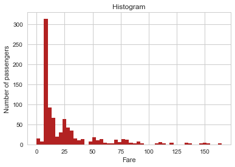
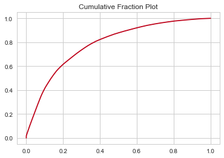
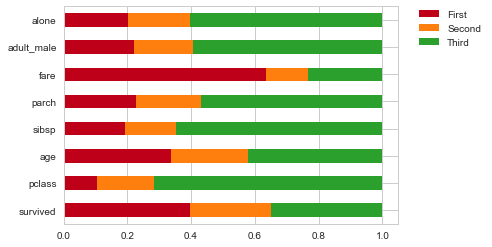

# Python EDA Toolbox

This repository is a collection of convenient methods and examples for novice data scientists or anyone who wants to use Python to analyse/visualize their data but found the abundance of libraries and functions a bit daunting. 

It's especially painful to work with dirty data. And the bad news - real-world data is almost always dirty. For a person with bad memory like me, I always found myself googling again and again for the exact syntax just to get the charts to look the way I like, or get that complicated transformation to work the way I want. 

So here, I try to summarize the commonly used methods, simplify the interface and provide some wrappers around popular libraries such as Pandas, Matplotlib, Seaborn, etc., setting the default values to the optimal and provide you more convenient options to manipulate the data and charts. __The objective - turn lines of code into one liners.__

With this little toolbox at hand, you would be able to easily:  

- Plot nice charts
- Get descriptive statistics
- Clean data
- Run statistical tests
- Many more...

No more messy code! No more endless googling!

Note: this is by no means a comphrehensive collection, and you will still need to use many of the functions in Pandas, Matplotlib, Seaborn, etc. to suit your needs. In fact, a lot of the functions there are already one-liners.
          
## Supported charts
Examples are shown in [here](notebook_examples/plotting.ipynb)

### 1. Histogram           
Histogram with options to set lower/upper bound of data, log scales, labels, title, etc.
```
plot_hist(df.fare, x_label='Fare', y_label='Number of passengers', ub=200)
```


### 2. Cumulative Fraction Plot (ECDF)          
Cumulative fraction plot with options to show x axis as cumulative sum, percentage, etc. Userful for skewed distributions. e.g.: 20% of my customers are giving me 80% of revenue.
```
plot_fraction(df.fare, x_cumulative=True, x_percentage=True)
```


### 3. Ratio bar plot           
Shows the relative distribution (sum) of each class along each dimension. 
```
plot_bar_ratio(df, by='class')
```
